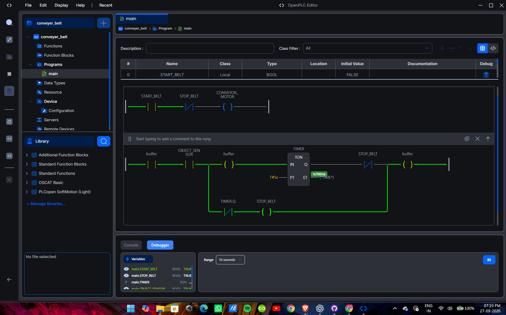

# Project #002 — Object Detection Conveyor

## 1. Project Overview

This is the second project in my PLC & Industrial Automation learning journey.

The project is a basic conveyor-belt control system developed using OpenPLC Editor V4 and tested using the OpenPLC Simulator.

The purpose of this project was to move beyond a simple motor Start/Stop circuit and introduce an object-detection sensor into the conveyor control logic.

---

## 2. Agenda

The main objectives of this project were:

- Understand how a conveyor motor can be controlled using PLC logic.
- Introduce an object-detection sensor into the control system.
- Understand how multiple conditions can affect one output.
- Practice Boolean logic in Ladder Logic.
- Learn how PLC inputs, internal logic and outputs interact.
- Test the complete logic using the OpenPLC Simulator.
- Understand and troubleshoot unexpected PLC behaviour.

---

## 3. Basic Idea

The basic idea is:

START THE CONVEYOR → CONVEYOR MOVES → OBJECT SENSOR DETECTS AN OBJECT → PLC RESPONDS ACCORDING TO THE PROGRAMMED LOGIC.

Instead of directly controlling the motor from a single switch, the PLC acts as the decision-making element between the inputs and the conveyor motor.

### Simplified Concept

START_BELT ─────┐
                │
STOP_BELT ──────┤
                │
OBJECT_SENSOR ──┤──> PLC LOGIC ───> CONVEYOR_MOTOR
                │
TIMER ──────────┘

The actual behaviour is determined by the Ladder Logic programmed inside the PLC project.

---

## 4. PLC Variables

The project uses Boolean variables representing the field inputs and output.

### Inputs / Control Variables

- `START_BELT` — starts the conveyor operation.
- `STOP_BELT` — stops the conveyor operation.
- `OBJECT_SENSOR` — represents detection of an object on the conveyor.
- `TIMER` — used as part of the control logic.

### Output

- `CONVEYOR_MOTOR` — represents the conveyor motor.

These variables allow the PLC program to separate the physical inputs from the final motor output.

---

## 5. Working Principle

The PLC continuously scans the programmed logic.

During each scan cycle:

1. The PLC reads the current input states.
2. The Ladder Logic evaluates the conditions.
3. The corresponding internal logic is processed.
4. The PLC updates the conveyor motor output.
5. The process repeats continuously.

This is the basic scan-cycle concept used in PLC systems.

The important concept learned here is that the PLC does not simply connect an input directly to an output. It evaluates the programmed conditions and determines the output state.

---

## 6. Ladder Logic Structure

The project uses Ladder Logic to represent the conveyor control sequence.

The main logic is built around:

START_BELT
     +
STOP_BELT
     +
OBJECT_SENSOR
     +
TIMER
     ↓
CONVEYOR_MOTOR

The individual conditions are combined using PLC Boolean logic to determine whether the conveyor motor should operate.

This project therefore builds on the basic motor Start/Stop concept from Project #001 and introduces additional control conditions.

---

## 7. Development Process

The project was developed incrementally rather than attempting to build the complete system at once.

The general development process was:

1. Create a new OpenPLC V4 project.
2. Define the required Boolean variables.
3. Build the conveyor control logic.
4. Add the object-detection condition.
5. Introduce timer-based behaviour.
6. Compile the project.
7. Test the logic using the OpenPLC Simulator.
8. Observe the input and output states.
9. Troubleshoot unexpected behaviour.
10. Modify and retest the logic.

---

## 8. Problems Encountered

The project did not work perfectly on the first attempt.

Some of the problems encountered during development included:

### Problem 1 — Input Behaviour

Some Boolean inputs did not initially behave exactly as expected during simulation.

This required checking the simulator states and verifying how each input affected the Ladder Logic.

### Problem 2 — Object Sensor Behaviour

The object sensor did not initially produce the expected motor response.

The logic had to be examined to understand whether the sensor should directly control the motor or whether it should act as one of several conditions in the control sequence.

### Problem 3 — Timer Behaviour

The timer was introduced to control part of the conveyor sequence.

Testing showed that timing conditions need to be considered carefully because PLC timers operate continuously according to the PLC scan and their programmed conditions.

### Problem 4 — Unexpected Boolean States

During simulation, some Boolean variables appeared in states that were not initially expected.

This demonstrated an important practical lesson:

Always verify the actual input state and the complete logic path instead of assuming that an output is wrong.

---

## 9. Troubleshooting Approach

The main troubleshooting method used was:

OBSERVE THE OUTPUT
        ↓
CHECK INPUT STATES
        ↓
CHECK LADDER LOGIC CONDITIONS
        ↓
CHECK TIMER / INTERNAL CONDITIONS
        ↓
MODIFY ONE PART OF THE LOGIC
        ↓
COMPILE
        ↓
SIMULATE AGAIN

This helped identify problems without completely rebuilding the project.

---

## 10. Final Working Principle

The final system operates as a PLC-controlled conveyor model.

The PLC continuously monitors the programmed Boolean conditions and timer state.

Based on these conditions, the PLC determines whether:

`CONVEYOR_MOTOR = TRUE`

or

`CONVEYOR_MOTOR = FALSE`

The object sensor is therefore not treated simply as a physical wire directly connected to the motor.

Instead:

Sensor / Input
      ↓
PLC Program
      ↓
Decision Logic
      ↓
Motor Output

This represents the fundamental purpose of a PLC-based control system.

---

## 11. Software Used

- OpenPLC Editor V4
- OpenPLC Simulator
- Ladder Logic
- GitHub
- GitHub Desktop

---

## 12. What I Learned

Through this project I learned:

- How to structure a PLC project beyond a basic motor circuit.
- How Boolean inputs can be combined to control an output.
- How a sensor can become part of a PLC control sequence.
- The importance of timers in automation logic.
- How the PLC scan cycle affects control behaviour.
- How to troubleshoot PLC logic systematically.
- Why an input should not automatically be connected directly to an output without considering the required control sequence.
- How to test PLC logic using simulation before considering physical hardware.

---

## 13. Project Status

**Status:** Completed

**Platform:** OpenPLC V4

**Simulation:** OpenPLC Simulator

**Project:** Object Detection Conveyor

**Project Number:** 002

---

## 14. Learning Journey

This project is part of my ongoing hands-on PLC and Industrial Automation portfolio.

The objective of this repository is not only to store completed projects, but also to document:

**What I built → Why I built it → How it works → What went wrong → How I fixed it → What I learned.**

---

## Project Evidence

